# CO₂ Clock - Real-Time Carbon Tracker


[](https://boneyphilip.github.io/duplicate-co2clock/)


> **A visual, interactive, and educational simulation of our planet’s rising CO₂ levels.**  
> Built to make climate data simple, accessible, and impactful — for learners, educators, and environmental advocates alike. 🌱  

## About

CO₂ Clock is a comprehensive web application designed to raise awareness about atmospheric carbon dioxide levels and their impact on climate change. The platform provides simulated real-time CO₂ tracking, interactive visualizations of global emissions data, and educational content about climate science and solutions.

This project aims to make climate data accessible and understandable for everyone, from students and educators to policymakers and environmental advocates. By presenting complex climate information in an engaging, visual format, CO₂ Clock encourages users to understand the urgency of climate action and explore practical solutions for reducing carbon emissions.

The website features a complete user journey including a homepage with CO₂ simulation, comprehensive emissions dashboard, educational articles, project information, contact functionality, and a user-friendly thank you page for form submissions. The site targets environmentally conscious individuals, educators, students, and anyone interested in understanding the current state of our atmosphere and the steps we can take to address climate change.

---
### Project Overview

| Page | File | Description | Key Features |
|------|------|--------------|---------------|
| 🏠 Home | `index.html` | Displays live CO₂ counter and intro info. | Animated CO₂ ppm counter, navigation links |
| 📊 Dashboard | `dash_board.html` | Data visualization of emissions. | Chart.js graphs, filter & sort |
| 📚 Articles | `articles.html` | Educational content hub. | Climate articles, explanations |
| ℹ️ About | `about.html` | Project purpose and background. | Data sources, mission |
| ✉️ Contact | `contact.html` | User inquiry form (FormSubmit). | Name/email form, validation |
| ✅ Thank You | `thank-you.html` | Confirmation after form submit. | Redirect and friendly message |

---

## Data Methodology
### 🔹 CO₂ Simulation
- **Baseline:** Approximately 428 ppm based on recent atmospheric measurements.
- **Increment calculation:** Small JS increments every few seconds to simulate rise.  
- **Purpose:** Educational — demonstrates how atmospheric CO₂ continuously rises (no live data)
```js
let co2ppm = 428.01;
setInterval(() => {
  co2ppm += 0.0002;
  document.getElementById("co2Value").textContent = co2ppm.toFixed(2);
}, 3000);
```
> This approach allows users to visualize ongoing emissions trends even without an active API connection.


### Emissions Data

- **Static dataset**: 70 countries with emissions data stored in JavaScript arrays
- **Data structure**: Each country includes rank, total emissions, per capita, percentage of global total
  ```js
  { country: "India", total: 2500, perCapita: 1.8, share: 7.1 }
  ```
- **Source basis**: Compiled from publicly available climate research and statistical sources (World Population Review, Global Carbon Atlas)
- **Update method**: Manual updates to JavaScript files when new data becomes available


### Charts and Visualizations
- **Library**: Chart.js powers all interactive charts and graphs
- **Purpose**: Create engaging bar and pie charts of CO₂ emissions
- **Data processing**: JavaScript functions dynamically sort, filter, and display data
- **Interactivity**: Hover tooltips and instant chart updates provide a real-time feel
- **Data Source**: All information is loaded from local JavaScript arrays (no external API)

*Note: This is an educational project using simulated and compiled data, not live API feeds.*

---

## ⚙️ JavaScript Logic Flow

The CO₂ Clock’s interactivity is powered entirely by **modular JavaScript**.  
Each script focuses on a specific purpose — from real-time simulations to chart rendering — making the project easy to maintain and expand.

---

### 🔁 Logical Flow Overview

```mermaid
graph TD;
    A[👋 User opens site] --> B[⚙️ index.js loads];
    B --> C[📈 Simulate CO₂ growth];
    C --> D[🧮 Update DOM with new ppm value];
    D --> E[📊 Dashboard.js renders Chart.js graphs];
    E --> F[🧠 Data filters and animations trigger];
    F --> G[🖱️ User interactions: hover, form, navigation];
    G --> H[💡 DOM updates → real-time feedback];
```


>Every user action triggers visual or numerical feedback, ensuring a continuous learning experience.
----

## 🧠 Core Logic Breakdown
#### 1️⃣ **CO₂ Counter Simulation (index.js)**

- Initializes baseline CO₂ level (e.g., 428.00 ppm)
- Increments value every few seconds to simulate atmospheric rise
- Updates the text content in the DOM for a live reading
- Uses setInterval() for smooth and continuous animation
```js
  let co2ppm = 428.00;
setInterval(() => {
  co2ppm += 0.0002;
  document.getElementById("co2Value").textContent = co2ppm.toFixed(2);
}, 3000);
```
🧩 Result: Creates a “real-time” counter effect using pure front-end logic.

#### 2️⃣ **Emissions Dashboard (dash_board.js)**

- Loads country emission data arrays
- Sorts and filters using JS functions
- Passes data to Chart.js for visual rendering
- Supports switching between total emissions, per capita, and global share
```js
const topCountries = emissionsData.sort((a, b) => b.total - a.total).slice(0, 20);
renderChart(topCountries);
```
📊 Result: Converts datasets into interactive charts with hover tooltips and legends.

#### 3️⃣ **Chart Rendering (Chart.js Integration)**

- Generates bar and pie charts dynamically
- Applies custom color palette (#00e6d2, #6bcb77, #ff2e63)
- Redraws graphs instantly when the user filters data
- Optimized for mobile responsiveness
  
🖼️ Result: Real-time data visualizations that adapt to user input.

#### 4️⃣ **User Interactions (DOM & Forms)**

- Smooth scroll navigation between sections
- Mobile navbar toggle for small screens
- Contact form submits via FormSubmit
- Displays a Thank You confirmation page on success
```js
form.addEventListener("submit", () => {
  window.location.href = "thank-you.html";
});
```
💬 Result: Enables communication and engagement without needing a backend.

### 5️⃣ **Performance Optimization**

- Preloads key assets (JS, CSS, images)
- Uses WebP for all major visuals
- Minified CSS and JS reduce load time
- Handles slow devices gracefully by limiting animation intensity

🚀 Result: Fast, efficient, and user-friendly on any device.

## 🔄 Overall Execution Flow
```csharp
[User Action / Page Load]
       ↓
[JavaScript Logic Triggers]
       ↓
[Data Processed by Arrays & Chart.js]
       ↓
[UI Updates: CO₂ Counter, Charts, or Forms]
       ↓
[Feedback Shown Instantly]
```
> ⚡ Everything happens live in the browser — no backend or API calls — making the experience fast, visual, and educational.
---

## 🧠 Code Architecture Diagram

The CO₂ Clock’s codebase follows a **modular and layered JavaScript structure**.  
Each script focuses on a distinct responsibility — simulation, visualization, interaction, or utility — ensuring **readability**, **reusability**, and **maintainability**.


### 🧩 File Interaction Overview


```md

🧭 **Flow Explanation**

- 🏠 **index.html** → Entry point showing live CO₂ simulation using inline JavaScript and Odometer.js  
- 📊 **dash_board.html** → Displays country-wise emissions via Chart.js  
- ℹ️ **about.html** → Describes project purpose and data methodology  
- 📚 **articles.html** → Lists educational content on climate and CO₂ science  
- ✉️ **contact.html** → Sends messages using FormSubmit (no backend)  
- ✅ **thank-you.html** → Shown after successful form submission  

External libraries (**Bootstrap 5**, **Font Awesome**, **Chart.js**, **Odometer.js**) are linked via CDN(Content Delivery Network) in the HTML files.  
All interactivity runs **entirely in-browser** — there is *no separate JS module or backend*.

```
---
## Table of Contents
- [Project Architecture](#project-architecture)
- [User Experience (UX)](#user-experience-ux)
- [Features](#features)
- [Technologies Used](#technologies-used)
- [Testing](#testing)
- [Deployment](#deployment)
- [Credits](#credits)

---
##  Project Architecture

The **CO₂ Clock** is designed like a living ecosystem — every layer plays a role in transforming *data into awareness*.  
It follows a fully **client-side architecture**, where all logic, visuals, and interactivity run inside the browser.  
No server, no database — just clean, optimized front-end engineering. 


### 🧬 System Blueprint

```SCSS
┌───────────────────────────────────────────────┐
│ 🌍 User Interface                             │
│ (index.html, dashboard, articles, etc.)       │
├────────────────────────────┬──────────────────┤
│ 🎨 Styling Layer │ 📊 Data Layer             │
│ (CSS / Bootstrap 5) │ (Static JS Arrays)      │
├────────────┬──────────────────────────────────┤
│ 📈 Visualization Layer – Chart.js & Custom JS │
│ (Data sorting, rendering, animations)         │        
├────────────┴──────────────────────────────────┤
│ ⚙️ Interaction Layer – Odometer.js, FormSubmit │
│ (CO₂ counter, forms, events, smooth UX)       │
└───────────────────────────────────────────────┘
```

---

### 🧩 Layer-by-Layer Breakdown

#### 1️⃣ **User Interface (HTML Pages)**
> The heart of the experience — clean, semantic, and purpose-driven.

- `index.html` → Launchpad for the live CO₂ counter simulation  
- `dash_board.html` → Interactive global emissions dashboard  
- `articles.html` → Educational content & climate knowledge hub  
- `about.html` → Methodology and project background  
- `contact.html` → User feedback & collaboration form  
- `thank-you.html` → Friendly post-submission confirmation  

Each page loads **modular scripts** and **shared styles**, ensuring quick rendering and maintainability.

---

#### 2️⃣ **Styling Layer (CSS + Bootstrap 5.3.6)**
> The visual personality of the project.

- Unified **dark-mode design** with teal accents (`#00e6d2`)  
- Built on **Bootstrap grid system** for consistent alignment  
- Smooth transitions (`0.3s ease`) and hover feedback  
- Accessibility-ready — high contrast, readable typography  
- Global theme file: `assets/css/style.css`  

💡 *Goal:* Modern, cinematic UI that communicates urgency with elegance.

---

#### 3️⃣ **Data Layer (Static JS Arrays)**
> The educational “brain” — all emissions and CO₂ data are stored locally.

- Includes 70+ countries’ CO₂ emission data

Example structure:
```js
{ country: "India", total: 2500, perCapita: 1.8, share: 7.1 }
```

- Data sourced from World Population Review, NOAA, and Global Carbon Atlas

- All datasets are loaded via JavaScript files for instant access

- Works completely offline for classroom and learning use

🧠 Idea: Transparent, open data that helps users learn by exploring.

---

#### 4️⃣ **Visualization Layer (Chart.js + Custom Logic)**

> Converts static numbers into interactive graphics.

- Uses Chart.js for real-time, animated visualizations

- Charts include bar graphs, pie charts, and global CO₂ breakdowns

- Custom color scheme (dark background + teal highlights)

- Hover tooltips for detailed per-country stats

- Fully responsive on mobile, tablet, and desktop

🎨 Purpose: Turn climate data into visual stories that engage curiosity.

---

#### 5️⃣ **Interaction Layer (Odometer.js + DOM Events)**

> The “motion engine” of the project.

- Odometer.js powers the animated CO₂ number counter (428 → 428.01 → 428.02 ppm …)

- Smooth scroll transitions and navigation highlights

- FormSubmit handles contact messages without backend setup

- Dynamic DOM updates show live feedback to user actions

🔥 Result: A fully interactive, immersive data experience.

----

### Data Flow Logic

```csharp
[User opens site]
        ↓
[index.html loads JS]
        ↓
[JS simulates CO₂ growth + updates DOM]
        ↓
[User navigates → dashboard.js renders charts]
        ↓
[Data filters & animations trigger in Chart.js]
        ↓
[User interacts → forms, navigation, hover tooltips]

```
### Design Philosophy
| Principle              | Description                                                            |
| ---------------------- | ---------------------------------------------------------------------- |
| 🌿 **Simplicity**      | Built entirely with HTML, CSS, and JS — no frameworks or dependencies. |
| 🔍 **Transparency**    | All data visible in-code for learning and research.                    |
| 💡 **Interactivity**   | Visual storytelling through dynamic updates and motion.                |
| ⚡ **Performance**      | Minified assets, WebP images, and fast load times.                     |
| ♿ **Accessibility**    | WCAG-friendly design with readable contrast and keyboard support.      |
| 🌎 **Education-First** | Built to *teach* climate data, not just show it.                       |

> 🪶 In essence,
**the CO₂ Clock architecture transforms static data into a visual experience —
where every number, color, and animation tells the story of our planet’s atmosphere in real time.**

----

###  Folder Structure

```bash
📦 duplicate-co2clock
├── 📜 index.html #        🌍 Home – Real-time CO₂ simulation counter
├── 📜 dash_board.html #   📊 Global emissions dashboard (Chart.js visualizations)
├── 📜 about.html #        ℹ️ Project information, background, and data methodology
├── 📜 articles.html #     📚 Educational content hub with climate insights
├── 📜 contact.html #      ✉️ Contact form integrated via FormSubmit
├── 📜 thank-you.html #    ✅ Confirmation page displayed after form submission
├── 📁 assets/ #           🖼️ Central directory for all static resources
│ ├── 📁 css/ #            🎨 Stylesheets for layout and responsive design
│ ├── 📁 js/ #             ⚙️ JavaScript files controlling interactivity and data logic
│ ├── 📁 images/ #         🧩 Optimized images, icons, and WebP assets
│ └── 📁 articles/ #       📰 Static content and article data (Markdown / HTML)
└── 📜 README.md #         🧾 Comprehensive documentation and project overview

```
---

## User Experience (UX)

### User Stories

#### First Time Visitor Goals
- I want to understand current atmospheric CO₂ levels and their significance
- I want to learn about global carbon emissions by country
- I want to access reliable, up-to-date climate data in an easy-to-understand format
- I want to discover practical solutions for addressing climate change

#### Returning Visitor Goals
- I want to track changes in atmospheric CO₂ levels over time
- I want to compare emissions data between different countries
- I want to access educational articles about climate science
- I want to share specific data visualizations with others

#### Frequent User Goals
- I want to monitor the latest climate data and trends
- I want to access new educational content about climate solutions
- I want to use the interactive dashboard for research or presentations

###  Design

### Color Scheme

| **Purpose** | **Color Code** | **Description** |
|--------------|----------------|-----------------|
|  **Primary Background** | `#222831` | Deep dark charcoal used across all pages for a sleek, modern dark theme. |
|  **Secondary Background** | `#393e46` | Medium gray for cards, dashboards, and section containers. |
|  **Accent Color** | `#00e6d2` | Bright teal highlight for buttons, links, and data counters — represents clean energy and innovation. |
|  **Border Color** | `#393e46` | Used for subtle dividers and element outlines to maintain structure without visual clutter. |
|  **Primary Text** | `#eeeeee` | Light gray used for body text and headings to ensure strong readability on dark backgrounds. |
| 🟢 **Success** | `#6bcb77` | Indicates positive trends or sustainable outcomes. |
| 🟡 **Warning** | `#f9ed69` | Highlights cautionary or neutral data points. |
| 🔴 **Danger** | `#ff2e63` | Used for critical alerts or negative environmental indicators. |

> The visual identity is inspired by clean energy tones — teal and green hues contrast against the dark base to create a balance between urgency and optimism.

---

### Typography

- **Primary Font:** `"Lora", "Barlow Condensed", system-ui, sans-serif`  
  → Combines elegance (Lora) with modern readability (Barlow Condensed).  
- **Numerical Display:** `"Courier New", "Barlow", Monaco, Consolas, monospace`  
  → Used for CO₂ counters and dashboard metrics for a technical, digital aesthetic.  
- **Readability Enhancements:**  
  - Increased letter spacing (`0.7px`)  
  - Line height (`1.6`) for better comfort on all screens  
  - Font smoothing enabled for crisp rendering  

---

### Imagery & Visual Identity

- **Hero Section:** Gradient overlays and animated teal accents symbolize continuous CO₂ growth and data flow.  
- **Dashboard:** Transparent card backgrounds with blur and shadows create a futuristic “data visualization” environment.  
- **About Section:** Uses `polluted-city.jpg` with a subtle green tint overlay — representing both pollution and hope for restoration.  
- **Charts:** Interactive **Chart.js** visuals styled with the project’s color palette for consistency.  
- **Icons:** Implemented via **Font Awesome 6** for unified and accessible iconography.  

---

### Layout & Responsiveness

- **Framework:** Built with **Bootstrap 5.3.6** for a responsive grid and consistent spacing.  
- **Approach:** *Mobile-first*, scaling fluidly to larger displays (up to 4K).  
- **Core Layout Techniques:**  
  - CSS Grid and Flexbox for adaptive component alignment  
  - Smooth hover transitions (`0.3s ease`)  
  - Rounded corners (`8px`) and layered shadows for depth  
- **Section Themes:**  
  - `.theme-dark` → Primary dark sections  
  - `.theme-light` → Light contrast bands for visual balance  
- **Accessibility:**  
  - High contrast text  
  - Keyboard-navigable components  
  - Clear hierarchy optimized for screen readers  

---

### Design Summary

> “CO₂ Clock” blends **data visualization with environmental storytelling** — a dark futuristic interface symbolizing current climate challenges, contrasted by bright teal elements representing *hope, innovation, and progress*.

---

## Features

### Real-Time CO₂ Tracker

- **Simulated atmospheric CO₂ levels** displayed with animated digit counters
- **Incremental updates** using JavaScript to simulate real-time changes
- **Educational baseline** showing current approximate atmospheric levels
- This feature helps users visualize the scale of current CO₂ concentrations

### Interactive Navigation


- **Responsive navigation bar** that works across all devices
- **Smooth scrolling** between sections for improved user experience
- **Active page indicators** to help users understand their current location
- **Mobile-friendly** hamburger menu for smaller screens

### Global Emissions Dashboard

- **Country-by-country emissions data** with interactive charts
- **Top 20 emitters visualization** with multiple viewing options (total, per capita, percentage)
- **Search and filter functionality** for exploring specific countries
- **Sortable data tables** for detailed analysis
- This comprehensive dashboard allows users to understand global emission patterns

### Climate Impact Facts

- **Key climate statistics** presented in digestible format
- **Temperature rise data** with historical context
- **Sea level rise information** and projections
- **Extreme weather trends** and their impacts
- Educational content helps users understand the broader implications of rising CO₂

### Interactive Charts and Visualizations

- **Dynamic bar charts** showing emissions by country
- **Multiple chart views** (total emissions, per capita, global percentage)
- **Hover tooltips** providing detailed information
- **Responsive design** that works on all screen sizes
- Charts are powered by Chart.js for smooth, interactive experiences

### Climate Solutions Section

- **Renewable energy information** with current statistics
- **Forest conservation data** and potential impact
- **Actionable solutions** that individuals and organizations can implement
- **Success stories** demonstrating that positive change is possible
- This section provides hope and practical steps for addressing climate change

### Educational Articles Hub

- **Curated climate science articles** covering key topics
- **CO₂ trends analysis** with historical data
- **Earth system science** explanations
- **Climate solutions research** and case studies
- Articles are designed to educate users about the science behind climate change

### Contact and Engagement

- **Contact form** powered by FormSubmit for user inquiries
- **Thank you page** with confirmation message and navigation options
- **Social media integration** for community building
- **Email communication** for updates and collaboration
- **GitHub integration** for open-source contributions

### Thank You Page

- **Form submission confirmation** with friendly eco-themed design
- **Clear success messaging** to reassure users their message was sent
- **Navigation options** to return to main site or explore articles
- **Consistent branding** maintaining the climate awareness theme
- **User-friendly redirect** after successful contact form submission

### Responsive Design

- **Mobile-first approach** ensuring great experience on all devices
- **Flexible layouts** that adapt to different screen sizes
- **Touch-friendly interfaces** for mobile users
- **Fast loading times** optimized for various connection speeds

---

## Technologies Used

### Languages
- **HTML5** - Semantic markup for structure and accessibility
- **CSS3** - Advanced styling with custom properties and responsive design
- **JavaScript ES6+** - Interactive functionality and data visualization

### Frameworks & Libraries
- **Bootstrap 5.3.6** - Responsive framework for rapid development
- **Chart.js** - Interactive charts and data visualizations
- **Font Awesome** - Professional iconography
- **Google Fonts** - Typography (Barlow Condensed, Gugi)

### Tools & Services
- **GitHub Pages** - Free hosting and deployment
- **FormSubmit** - Contact form processing
- **Odometer.js** - Animated number counters
- **Git** - Version control
- **VS Code** - Development environment

### Data Sources & Implementation
- **Static CO₂ simulation** - Pre-written data in JavaScript mimicking atmospheric readings
- **Emissions dataset** - Country emissions data stored in JavaScript arrays (based on World Population Review)
- **Climate statistics** - Educational data compiled from various scientific sources

---

## Testing

### Website Performance Metrics


**Overall Lighthouse Scores:**
- 🚀 **Performance**: 90+ (Fast loading, optimized resources)
- ♿ **Accessibility**: 90+ (Screen reader friendly, keyboard navigation)
- 🔍 **SEO**: 90+ (Search engine optimized)
- ✅ **Best Practices**: 90+ (Security, modern web standards)

### Validator Testing

#### HTML
- All pages pass [W3C HTML Validator](https://validator.w3.org/) with no errors
- Semantic HTML5 elements used throughout for accessibility
- ARIA labels implemented for screen reader compatibility

#### CSS  
- CSS passes [W3C CSS Validator](https://jigsaw.w3.org/css-validator/) with no errors
- Modern CSS features like custom properties and grid used effectively
- Responsive design tested across multiple breakpoints

#### JavaScript
- Code passes JSHint validation with no significant issues
- ES6+ features used where appropriate
- Data arrays properly structured and accessible
- Interactive functions work smoothly across all browsers

### Performance Testing

- **Lighthouse Performance Score** - 90+ on all pages
- **PageSpeed Insights** - Optimized for both mobile and desktop
- **Image optimization** - WebP format used where supported
- **Code minification** - CSS and JS optimized for production

### Accessibility Testing

- **WAVE Web Accessibility Evaluator** - No errors detected
- **Lighthouse Accessibility Score** - 90+ on all pages
- **Keyboard navigation** - All interactive elements accessible via keyboard
- **Screen reader compatibility** - Tested with NVDA and VoiceOver

### Browser Compatibility
- **Chrome** (latest) ✅
- **Firefox** (latest) ✅  
- **Safari** (latest) ✅
- **Edge** (latest) ✅
- **Mobile browsers** ✅

### Device Testing
- **Desktop** (1920x1080) ✅
- **Laptop** (1366x768) ✅
- **Tablet** (768x1024) ✅
- **Mobile** (375x667) ✅
- **Large screens** (2560x1440) ✅

### User Testing
- **Navigation flow** - Users can easily find information across all pages
- **Data interpretation** - Charts and visualizations are clear and intuitive
- **Form submission** - Contact form works reliably with proper thank you page redirect
- **Mobile experience** - Touch interfaces are intuitive on all devices
- **Page transitions** - Smooth navigation between home, dashboard, articles, about, contact, and thank you pages

### Known Issues
- Chart animations may be reduced on older devices for performance
- Video background falls back to static image on very slow connections
- Some older browsers (IE11) require polyfills for modern JavaScript features

---

## Deployment

### GitHub Pages Deployment

The site is deployed using GitHub Pages. The deployment process:

1. Navigate to the GitHub repository settings
2. Scroll to the **Pages** section in the left sidebar
3. Under **Source**, select **Deploy from a branch**
4. Choose **main** branch and **/ (root)** folder
5. Click **Save**
6. GitHub automatically builds and deploys the site
7. Site becomes available at: `https://username.github.io/repository-name/`

### Local Development

To run the project locally:

```bash
# Clone the repository
git clone https://github.com/boneyphilip/duplicate-co2clock.git

# Navigate to project directory
cd duplicate-co2clock

# Project structure includes:
# - index.html (homepage with CO₂ tracker)
# - dash_board.html (emissions dashboard)
# - articles.html (educational content hub)
# - about.html (project information)
# - contact.html (contact form)
# - thank-you.html (form submission confirmation)
# - assets/ (CSS, JS, images, articles)

# Open with live server or serve files locally
# No build process required - pure HTML/CSS/JS
```

### Environment Variables
- No environment variables required
- All data is stored locally in JavaScript files
- No external API dependencies

---

## Credits

### Content
- **Baseline CO₂ data** - Inspired by NOAA Global Monitoring Laboratory measurements
- **Emissions statistics** - Compiled from World Population Review and Global Carbon Atlas
- **Scientific information** - IPCC reports and NASA climate research
- **Educational content** - Various peer-reviewed climate science papers
- **Country data** - Manually researched and compiled into JavaScript arrays

### Code
- **Chart.js integration** - Official Chart.js documentation
- **Bootstrap components** - Bootstrap 5.3.6 documentation
- **Responsive design patterns** - CSS Grid and Flexbox best practices
- **Accessibility features** - WCAG 2.1 guidelines

### Media
- **Hero video** - CO₂ emissions visualization (royalty-free)
- **Climate images** - Unsplash and Pexels (credited in alt text)
- **Icons** - Font Awesome 6.0+ icon library
- **Flags** - FlagCDN for country flag images

### Inspiration
- **NASA Climate Change** - Data visualization approaches
- **Climate.gov** - Educational content structure
- **Carbon Brief** - Scientific communication style
- **Our World in Data** - Interactive chart designs

### Special Thanks
- **Code Institute** - Project structure and best practices
- **Climate science community** - For making data publicly available
- **Open source contributors** - Chart.js, Bootstrap, and other libraries
- **Environmental educators** - For inspiration on making climate data accessible

---

## Future Enhancements

- **Real-time API integration** - Connect to actual NOAA monitoring stations for live data
- **Historical data timeline** - Interactive CO₂ trends over centuries
- **Personal carbon calculator** - Help users understand their impact
- **Regional data breakdown** - State/province level emissions data
- **Multilingual support** - Translate content for global accessibility
- **Data export features** - Allow users to download datasets for research
- **User accounts** - Save preferences and track learning progress

---

## Contact

**Developer**: Boney Philip  
**Email**: [co2clock.contact@gmail.com](mailto:co2clock.contact@gmail.com)  
**GitHub**: [@boneyphilip](https://github.com/boneyphilip)  
**Live Site**: [https://boneyphilip.github.io/duplicate-co2clock/](https://boneyphilip.github.io/duplicate-co2clock/)

---

*Built with 🌱 for climate awareness and action*
