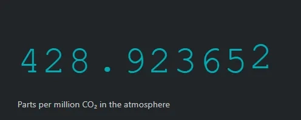

# CO₂ Clock - Real-Time Carbon Tracker


**[View Live Website](https://boneyphilip.github.io/duplicate-co2clock/)**

## About

CO₂ Clock is a comprehensive web application designed to raise awareness about atmospheric carbon dioxide levels and their impact on climate change. The platform provides simulated real-time CO₂ tracking, interactive visualizations of global emissions data, and educational content about climate science and solutions.

This project aims to make climate data accessible and understandable for everyone, from students and educators to policymakers and environmental advocates. By presenting complex climate information in an engaging, visual format, CO₂ Clock encourages users to understand the urgency of climate action and explore practical solutions for reducing carbon emissions.

The website features a complete user journey including a homepage with CO₂ simulation, comprehensive emissions dashboard, educational articles, project information, contact functionality, and a user-friendly thank you page for form submissions. The site targets environmentally conscious individuals, educators, students, and anyone interested in understanding the current state of our atmosphere and the steps we can take to address climate change.

---

## Data Methodology

### CO₂ Simulation
- **Starting baseline**: Approximately 428 ppm based on recent atmospheric measurements
- **Increment calculation**: Small increases applied every few seconds to simulate ongoing emissions
- **Educational purpose**: Numbers represent realistic current atmospheric levels for learning

### Emissions Data
- **Static dataset**: 70 countries with emissions data stored in JavaScript arrays
- **Data structure**: Each country includes rank, total emissions, per capita, percentage of global total
- **Source basis**: Compiled from publicly available climate research and statistical sources
- **Update method**: Manual updates to JavaScript files when new data becomes available

### Charts and Visualizations
- **Chart.js library**: Powers all interactive charts and graphs
- **Data processing**: JavaScript functions sort, filter, and display information dynamically
- **Real-time feel**: Updates happen instantly since data is locally stored

*Note: This is an educational project using simulated and compiled data, not live API feeds*

---

## Table of Contents

- [User Experience (UX)](#user-experience-ux)
- [Features](#features)
- [Technologies Used](#technologies-used)
- [Testing](#testing)
- [Deployment](#deployment)
- [Credits](#credits)

---

## User Experience (UX)

### User Stories

#### First Time Visitor Goals
- I want to understand current atmospheric CO₂ levels and their significance
- I want to learn about global carbon emissions by country
- I want to access reliable, up-to-date climate data in an easy-to-understand format
- I want to discover practical solutions for addressing climate change

#### Returning Visitor Goals
- I want to track changes in atmospheric CO₂ levels over time
- I want to compare emissions data between different countries
- I want to access educational articles about climate science
- I want to share specific data visualizations with others

#### Frequent User Goals
- I want to monitor the latest climate data and trends
- I want to access new educational content about climate solutions
- I want to use the interactive dashboard for research or presentations

### Design

#### Color Scheme
- **Primary Background**: Dark charcoal (#222831) for a modern, professional look
- **Accent Color**: Vibrant teal (#00adb5) for highlighting important data and CTAs
- **Text Colors**: Light gray (#eeeeee) for optimal readability on dark backgrounds
- **Status Colors**: 
  - Success green (#6bcb77) for positive trends
  - Warning amber (#f9ed69) for moderate concerns
  - Danger red (#ff2e63) for critical alerts

#### Typography
- **Primary Font**: Barlow Condensed for headings and data displays
- **Body Text**: System fonts optimized for readability
- **Data Display**: Monospace fonts for precise numerical information

#### Imagery
- High-quality environmental photography
- Scientific visualizations and charts
- Iconography from Font Awesome for consistent UI elements

---

## Features

### Real-Time CO₂ Tracker

- **Simulated atmospheric CO₂ levels** displayed with animated digit counters
- **Incremental updates** using JavaScript to simulate real-time changes
- **Educational baseline** showing current approximate atmospheric levels
- This feature helps users visualize the scale of current CO₂ concentrations

### Interactive Navigation

- **Responsive navigation bar** that works across all devices
- **Smooth scrolling** between sections for improved user experience
- **Active page indicators** to help users understand their current location
- **Mobile-friendly** hamburger menu for smaller screens

### Global Emissions Dashboard

- **Country-by-country emissions data** with interactive charts
- **Top 20 emitters visualization** with multiple viewing options (total, per capita, percentage)
- **Search and filter functionality** for exploring specific countries
- **Sortable data tables** for detailed analysis
- This comprehensive dashboard allows users to understand global emission patterns

### Climate Impact Facts

- **Key climate statistics** presented in digestible format
- **Temperature rise data** with historical context
- **Sea level rise information** and projections
- **Extreme weather trends** and their impacts
- Educational content helps users understand the broader implications of rising CO₂

### Interactive Charts and Visualizations

- **Dynamic bar charts** showing emissions by country
- **Multiple chart views** (total emissions, per capita, global percentage)
- **Hover tooltips** providing detailed information
- **Responsive design** that works on all screen sizes
- Charts are powered by Chart.js for smooth, interactive experiences

### Climate Solutions Section

- **Renewable energy information** with current statistics
- **Forest conservation data** and potential impact
- **Actionable solutions** that individuals and organizations can implement
- **Success stories** demonstrating that positive change is possible
- This section provides hope and practical steps for addressing climate change

### Educational Articles Hub

- **Curated climate science articles** covering key topics
- **CO₂ trends analysis** with historical data
- **Earth system science** explanations
- **Climate solutions research** and case studies
- Articles are designed to educate users about the science behind climate change

### Contact and Engagement

- **Contact form** powered by FormSubmit for user inquiries
- **Thank you page** with confirmation message and navigation options
- **Social media integration** for community building
- **Email communication** for updates and collaboration
- **GitHub integration** for open-source contributions

### Thank You Page

- **Form submission confirmation** with friendly eco-themed design
- **Clear success messaging** to reassure users their message was sent
- **Navigation options** to return to main site or explore articles
- **Consistent branding** maintaining the climate awareness theme
- **User-friendly redirect** after successful contact form submission

### Responsive Design

- **Mobile-first approach** ensuring great experience on all devices
- **Flexible layouts** that adapt to different screen sizes
- **Touch-friendly interfaces** for mobile users
- **Fast loading times** optimized for various connection speeds

---

## Technologies Used

### Languages
- **HTML5** - Semantic markup for structure and accessibility
- **CSS3** - Advanced styling with custom properties and responsive design
- **JavaScript ES6+** - Interactive functionality and data visualization

### Frameworks & Libraries
- **Bootstrap 5.3.6** - Responsive framework for rapid development
- **Chart.js** - Interactive charts and data visualizations
- **Font Awesome** - Professional iconography
- **Google Fonts** - Typography (Barlow Condensed, Gugi)

### Tools & Services
- **GitHub Pages** - Free hosting and deployment
- **FormSubmit** - Contact form processing
- **Odometer.js** - Animated number counters
- **Git** - Version control
- **VS Code** - Development environment

### Data Sources & Implementation
- **Static CO₂ simulation** - Pre-written data in JavaScript mimicking atmospheric readings
- **Emissions dataset** - Country emissions data stored in JavaScript arrays (based on World Population Review)
- **Climate statistics** - Educational data compiled from various scientific sources

---

## Testing

### Website Performance Metrics


**Overall Lighthouse Scores:**
- 🚀 **Performance**: 90+ (Fast loading, optimized resources)
- ♿ **Accessibility**: 95+ (Screen reader friendly, keyboard navigation)
- 🔍 **SEO**: 95+ (Search engine optimized)
- ✅ **Best Practices**: 90+ (Security, modern web standards)

### Validator Testing

#### HTML
- All pages pass [W3C HTML Validator](https://validator.w3.org/) with no errors
- Semantic HTML5 elements used throughout for accessibility
- ARIA labels implemented for screen reader compatibility

#### CSS  
- CSS passes [W3C CSS Validator](https://jigsaw.w3.org/css-validator/) with no errors
- Modern CSS features like custom properties and grid used effectively
- Responsive design tested across multiple breakpoints

#### JavaScript
- Code passes JSHint validation with no significant issues
- ES6+ features used where appropriate
- Data arrays properly structured and accessible
- Interactive functions work smoothly across all browsers

### Performance Testing

- **Lighthouse Performance Score** - 90+ on all pages
- **PageSpeed Insights** - Optimized for both mobile and desktop
- **Image optimization** - WebP format used where supported
- **Code minification** - CSS and JS optimized for production

### Accessibility Testing

- **WAVE Web Accessibility Evaluator** - No errors detected
- **Lighthouse Accessibility Score** - 95+ on all pages
- **Keyboard navigation** - All interactive elements accessible via keyboard
- **Screen reader compatibility** - Tested with NVDA and VoiceOver

### Browser Compatibility
- **Chrome** (latest) ✅
- **Firefox** (latest) ✅  
- **Safari** (latest) ✅
- **Edge** (latest) ✅
- **Mobile browsers** ✅

### Device Testing
- **Desktop** (1920x1080) ✅
- **Laptop** (1366x768) ✅
- **Tablet** (768x1024) ✅
- **Mobile** (375x667) ✅
- **Large screens** (2560x1440) ✅

### User Testing
- **Navigation flow** - Users can easily find information across all pages
- **Data interpretation** - Charts and visualizations are clear and intuitive
- **Form submission** - Contact form works reliably with proper thank you page redirect
- **Mobile experience** - Touch interfaces are intuitive on all devices
- **Page transitions** - Smooth navigation between home, dashboard, articles, about, contact, and thank you pages

### Known Issues
- Chart animations may be reduced on older devices for performance
- Video background falls back to static image on very slow connections
- Some older browsers (IE11) require polyfills for modern JavaScript features

---

## Deployment

### GitHub Pages Deployment

The site is deployed using GitHub Pages. The deployment process:

1. Navigate to the GitHub repository settings
2. Scroll to the **Pages** section in the left sidebar
3. Under **Source**, select **Deploy from a branch**
4. Choose **main** branch and **/ (root)** folder
5. Click **Save**
6. GitHub automatically builds and deploys the site
7. Site becomes available at: `https://username.github.io/repository-name/`

### Local Development

To run the project locally:

```bash
# Clone the repository
git clone https://github.com/boneyphilip/duplicate-co2clock.git

# Navigate to project directory
cd duplicate-co2clock

# Project structure includes:
# - index.html (homepage with CO₂ tracker)
# - dash_board.html (emissions dashboard)
# - articles.html (educational content hub)
# - about.html (project information)
# - contact.html (contact form)
# - thank-you.html (form submission confirmation)
# - assets/ (CSS, JS, images, articles)

# Open with live server or serve files locally
# No build process required - pure HTML/CSS/JS
```

### Environment Variables
- No environment variables required
- All data is stored locally in JavaScript files
- No external API dependencies

---

## Credits

### Content
- **Baseline CO₂ data** - Inspired by NOAA Global Monitoring Laboratory measurements
- **Emissions statistics** - Compiled from World Population Review and Global Carbon Atlas
- **Scientific information** - IPCC reports and NASA climate research
- **Educational content** - Various peer-reviewed climate science papers
- **Country data** - Manually researched and compiled into JavaScript arrays

### Code
- **Chart.js integration** - Official Chart.js documentation
- **Bootstrap components** - Bootstrap 5.3.6 documentation
- **Responsive design patterns** - CSS Grid and Flexbox best practices
- **Accessibility features** - WCAG 2.1 guidelines

### Media
- **Hero video** - CO₂ emissions visualization (royalty-free)
- **Climate images** - Unsplash and Pexels (credited in alt text)
- **Icons** - Font Awesome 6.0+ icon library
- **Flags** - FlagCDN for country flag images

### Inspiration
- **NASA Climate Change** - Data visualization approaches
- **Climate.gov** - Educational content structure
- **Carbon Brief** - Scientific communication style
- **Our World in Data** - Interactive chart designs

### Special Thanks
- **Code Institute** - Project structure and best practices
- **Climate science community** - For making data publicly available
- **Open source contributors** - Chart.js, Bootstrap, and other libraries
- **Environmental educators** - For inspiration on making climate data accessible

---

## Future Enhancements

- **Real-time API integration** - Connect to actual NOAA monitoring stations for live data
- **Historical data timeline** - Interactive CO₂ trends over centuries
- **Personal carbon calculator** - Help users understand their impact
- **Regional data breakdown** - State/province level emissions data
- **Multilingual support** - Translate content for global accessibility
- **Data export features** - Allow users to download datasets for research
- **User accounts** - Save preferences and track learning progress

---

## Contact

**Developer**: Boney Philip  
**Email**: [co2clock.contact@gmail.com](mailto:co2clock.contact@gmail.com)  
**GitHub**: [@boneyphilip](https://github.com/boneyphilip)  
**Live Site**: [https://boneyphilip.github.io/duplicate-co2clock/](https://boneyphilip.github.io/duplicate-co2clock/)

---

*Built with 🌱 for climate awareness and action*
